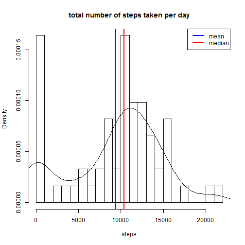
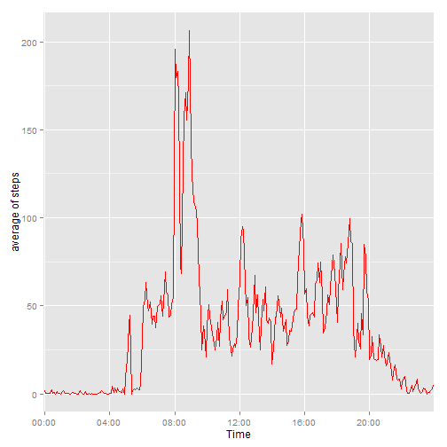
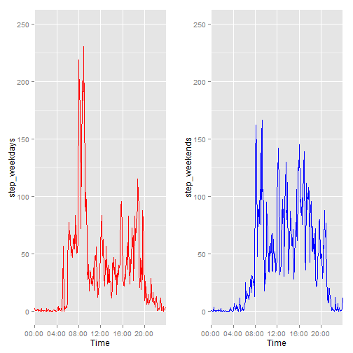

This is a document about a Activity monitoring DATA
##Need the "dplyr" and "ggplot2" packages

```r
library(dplyr)
library(ggplot2)
```

##Loading and preprocessing the data

```r
df<-tbl_df(read.csv("activity.csv")) #load "activity.csv"
df_date<-group_by(df,date) #group the data by date
```
##What is mean total number of steps taken per day?
1.calculate the total number of steps taken each day  

```r
result_sum<-summarize(df_date,sum(steps,na.rm=TRUE))
```
2.Calculate and report the mean and median total number of steps taken per day

```r
mx<-mean(result_sum$sum) #calculatet the mean total steps taken per day
print(mx)
```

```
## [1] 9354
```

```r
md<-median(result_sum$sum)#calculatet the median total steps taken per day
print(md)
```

```
## [1] 10395
```

```r
hist(result_sum$sum,20,main="total number of steps taken per day",xlab="steps"
     ,prob=TRUE)
lines(density(result_sum$sum))
abline(v=mx,col="blue",lwd="2")
abline(v=md,col="red",lwd="2")
legend("topright", c("mean", "median"), col=c("blue", "red"), lwd=2)
```

 
3.What is the average daily activity pattern?

```r
df_interval<-group_by(df,interval) #group the data by interval
result_daily<-summarize(df_interval,step_means=mean(steps,na.rm=T)) #get the average steps for each interval
result_daily<-mutate(result_daily,Times=paste(sprintf("%02d:%02d",interval %/% 100,interval%%60))) #transfer the integer to the Time 
ggplot(data=result_daily,aes(x=Times,y=step_means,group=1))+ 
        geom_line(colour="red")+
        scale_x_discrete(breaks=c("00:00","04:00","08:00","12:00","16:00","20:00"),name="Time")+
        scale_y_continuous(name="average of steps") #average daily activity pattern
```

 

#####Which 5-minute interval, on average across all the days in the dataset, contains the maximum number of steps?


```r
filter(result_daily,step_means==max(step_means))
```

```
## Source: local data frame [1 x 3]
## 
##   interval step_means Times
## 1      835      206.2 08:55
```
#####It has maximum number of stpes at 08:55.

4.Imputing missing values


```r
length(which(is.na(df$steps)))/length(df$steps) #find the data NA's ratio
```

```
## [1] 0.1311
```

#####about 13% NAs in data


```r
        df_sum2<-
        df %>% 
        group_by(interval) %>%
        mutate(steps= replace(steps, is.na(steps), mean(steps, na.rm=TRUE))) %>%
        #replace the NAs with interval average steps
        summarize(sum(steps))
mx2<-mean(df_sum2$sum) #calculatet the mean total steps taken per day
md2<-median(df_sum2$sum)#calculatet the median total steps taken per day
hist(df_sum2$sum,20,main="total number of steps taken per day",xlab="steps"
     ,prob=TRUE)
lines(density(df_sum2$sum))
abline(v=mx2,col="blue",lwd="2")
abline(v=md2,col="red",lwd="2")
legend("topright", c("mean", "median"), col=c("blue", "red"), lwd=2)
```

 

#####The mean and median value of total number of steps taken per day were shift to low value when replace NAs with average steps in 5-minute interval

5.Are there differences in activity patterns between weekdays and weekends?


```r
library(timeDate) #load the timeDate package
df_sum3<-
        df %>% 
        group_by(interval) %>%
        mutate(steps= replace(steps, is.na(steps), mean(steps, na.rm=TRUE)))
df_sum3<-mutate(ungroup(df_sum3),weekdays=isWeekday(as.POSIXlt(df_sum3$date)))
df_weekdays<- #find weekdays steps
        df_sum3 %>%
        filter(weekdays==TRUE) %>%
        group_by(interval) %>%
        summarize(step_weekdays=mean(steps)) %>%
        mutate(Times=paste(sprintf("%02d:%02d",interval %/% 100,interval%%60)))
df_weekends<- #find weekends steps
        df_sum3 %>%
        filter(weekdays==FALSE) %>%
        group_by(interval) %>%
        summarize(step_weekends=mean(steps)) 
df_final<-select(cbind(df_weekdays,df_weekends),Times,step_weekdays,step_weekends)
```

#####make a plot

```r
library(gridExtra)#load the package "gridExtra"
sp1<-ggplot(data=df_final,aes(x=Times,y=step_weekdays,group=1))+ 
        geom_line(colour="red")+
        scale_x_discrete(breaks=c("00:00","04:00","08:00","12:00","16:00","20:00"),name="Time")+
        scale_y_continuous(name="steps in weekdays")+#average daily activity pattern
        ylim(0,250)
```

```
## Scale for 'y' is already present. Adding another scale for 'y', which will replace the existing scale.
```

```r
sp2<-ggplot(data=df_final,aes(x=Times,y=step_weekends,group=1))+ 
        geom_line(colour="blue")+
        scale_x_discrete(breaks=c("00:00","04:00","08:00","12:00","16:00","20:00"),name="Time")+
        scale_y_continuous(name="steps in weekends")+ #average daily activity pattern
        ylim(0,250)
```

```
## Scale for 'y' is already present. Adding another scale for 'y', which will replace the existing scale.
```

```r
library(gridExtra)
sidebysideplot<-grid.arrange(sp1,sp2,ncol=2)
```

 

#####It seem that the weekends have more steps than weekdays in the afternoon.

